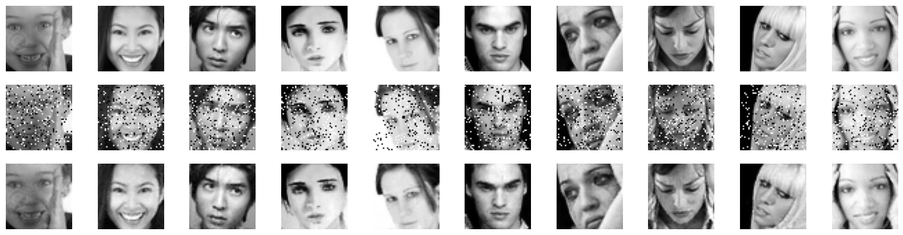

# GAN for Image Denoising and Reconstruction

This repository contains my implementation and analysis of a **Generative Adversarial Network (GAN)** as part of my Computer Vision coursework.  
The project applies GANs to the **FER2013 facial expression dataset** (48×48 grayscale images), focusing on **image denoising and reconstruction** under Salt & Pepper noise.

---

## 📌 Project Overview
- **Dataset: FER2013**
  - Grayscale 48×48 facial expression images across 7 emotion categories.
  - Preprocessed and normalized to `[0,1]`.
  - Corrupted with **Salt & Pepper noise** to evaluate reconstruction.

- **Generator (U-Net based)**:
  - Encoder for hierarchical feature extraction.
  - Bottleneck with 256-channel representation.
  - Decoder with transposed convolutions and **skip connections** for detail recovery.
  - Sigmoid activation for final pixel-level reconstruction.

- **Discriminator**:
  - 4 convolutional layers with BatchNorm and LeakyReLU.
  - Dropout layers for stability.
  - Sigmoid output for real vs. fake classification.

- **Training Objective**:
  - Generator loss = **MSE reconstruction loss + λ · adversarial loss**.
  - Discriminator loss = **Binary Cross-Entropy (BCE)**.
  - Optimizer: Adam for both networks.
  - Epochs: 10 baseline runs.

- **Evaluation Metrics**:
  - **PSNR (Peak Signal-to-Noise Ratio)**
  - **SSIM (Structural Similarity Index)**
  - **MSE (Mean Squared Error)**

---

## 📂 Repository Structure
- `GAN_Image_Denoising_Reconstruction.ipynb` – Jupyter Notebook with GAN implementation and experiments
- `code-report.pdf` – Report (Part 2: GAN results and analysis)
- `assignment.png` – Homework description (in Persian)
- `images/gan_results_1.png` – Example denoising result
- `images/gan_results_2.png` – Example denoising result

---

## 🚀 How to Run
1. Clone the repository:
   ```bash
   git clone https://github.com/<your-username>/GAN-Image-Denoising-Reconstruction.git
   cd GAN-Image-Denoising-Reconstruction
   ```
2. Install dependencies:
   ```bash
   pip install torch torchvision numpy matplotlib scikit-learn scikit-image
   ```
3. Run the notebook:
   ```bash
   jupyter notebook GAN_Image_Denoising_Reconstruction.ipynb
   ```

---

## 📊 Results
- GAN reconstructed noisy FER2013 images with significantly improved quality.  
- Reconstructed outputs were **sharper and visually more faithful** to the original facial expressions.  
- Quantitative evaluation confirmed gains in PSNR, SSIM, and MSE compared to reconstruction-only baselines.  

### 🔹 Example Reconstructions
Ground Truth →  Noisy → Reconstructed (GAN) 

  


---

## 📖 References
- FER2013 dataset: [Kaggle link](https://www.kaggle.com/datasets/deadskull7/fer2013)  
